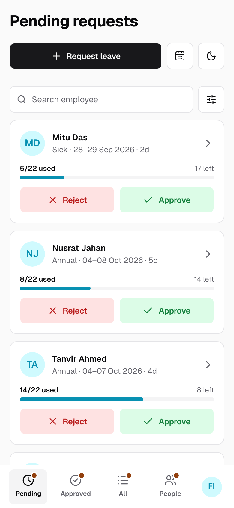
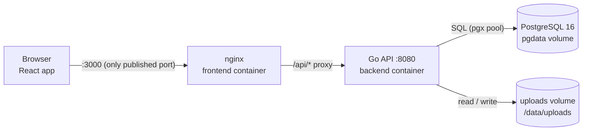

# LeaveDesk

Leave management for a small company. Employees request leave on a calendar, HR approves or rejects it, and balances update automatically. Go API, PostgreSQL and a React SPA, run with Docker Compose. Design notes are in [docs/EXPLANATION.md](docs/EXPLANATION.md).


## What it does

- **Two roles.** Employees request leave; HR decides. The first account becomes HR, as does anyone in the Human Resources department.
- **Requests.** Pick dates on a calendar; Fri and Sat are never counted. Overlaps and insufficient balance are rejected, by the form and again by the API.
- **Decisions.** HR approves or rejects from the Pending table or a review page, with a 5-second Undo. Nobody decides their own request.
- **Balances.** A yearly allowance per type (Annual 16, Casual 3, Sick 3 by default): `available = limit − used − pending`. HR can override limits per person and year.
- **Team view.** A calendar page shows who is away each day; every HR table exports to CSV.
- **People.** HR manages department, salary history and leave limits; every change is audit-logged.
- **Auth.** Email and password, or optional Google sign-in. The session is a JWT in an httpOnly cookie; the role is reloaded from the database on every request.

## Screenshots

| HR | Employee |
|---|---|
| <br>**Review:** who is asking, how many days are left, and which teammates are away on the same dates. | <br>**My leave:** available days in total and per type, with pending requests below. |
| <br>**Team calendar:** a page showing who is away each day; pending leave has a dashed ring. The month and day stay in the URL. | <br>**Request leave:** the form explains a problem before anything is sent. |

<p>
  
  
</p>

On phones, the sidebar becomes a bottom tab bar and tables become cards. Both themes work everywhere.

<details>
<summary>More screenshots</summary>


**Sign in.**


**People:** everyone's leave this year, searchable and filterable by department.


**Employee page:** department, salary history and this year's leave limits, which can't go below the days already used.


**Request details:** HR's note and an in-page PDF preview of the attachment.


**History** in the dark theme.

</details>

## Quick start

```bash
cp .env.example .env
make up
make seed
```

Open **http://localhost:3000**. Every demo password is `password123`.

| Role | Email | Notes |
|---|---|---|
| HR | `hr@company.test` | Farhana Islam |
| Employee | `nusrat.j@company.test` | 8 days available, a pending request for 04–08 Oct, and a rejected request with a PDF |
| Employee | `rakib.h@company.test` | Joined this week, no leave history yet |

## Tech stack

| Layer | Choice | Why |
|---|---|---|
| API | Go 1.23, standard library `net/http` | Go 1.22 route patterns cover every route; no framework |
| Database | PostgreSQL 16, `pgx/v5`, hand-written SQL | Constraints, date maths and advisory locks for the concurrency rules |
| Migrations | `golang-migrate/v4`, SQL embedded in the binary | Applied on startup |
| Auth | bcrypt, `golang-jwt/jwt/v5` (HS256), Google OpenID Connect | Stateless signed session in an httpOnly cookie |
| UI | React 19, TypeScript (strict), React Router 7, Vite 8 | Typed SPA with client-side routing |
| Server state | TanStack Query 5, TanStack Table 8 | Caching, invalidation and server-paged tables |
| Components | shadcn/ui (Radix), Tailwind CSS 4, lucide | Accessible primitives; light/dark design tokens |
| Serving | nginx | Serves the build and proxies `/api` on the same origin (no CORS) |
| Tests | Go `testing`, Node's test runner, Playwright | Unit tests without extra frameworks; browser tests in real Chrome |

## Architecture



## Commands

| Command | What it does |
|---|---|
| `make up` / `make down` | Build and start / stop the stack |
| `make seed` | Replace all data with the demo company |
| `make reset` | Delete the database and uploaded files |
| `make logs` | Follow the API's JSON log |
| `make test` | `go vet` and the Go unit tests, in a Go container |
| `cd frontend && npm test` | Frontend unit tests (Node's test runner) |
| `make e2e` / `make e2e-down` | Playwright browser tests on a separate stack (:3100, own database) / remove it |
| `cd frontend && API_PROXY=http://localhost:3000 npm run dev` | UI dev server on :5173 against the running stack |
| `make screenshots` | Retake the README screenshots from the running app |
| `docker compose exec backend /app/leavedesk promote --email …` | Make someone HR (`demote` refuses to remove the last HR) |

## Google sign-in (optional)

Email and password always work; the Google button appears only when a client is configured.

1. In Google Cloud Console, create an OAuth client of type **Web application** with origin `http://localhost:3000` and redirect URI `http://localhost:3000/api/auth/google/callback`. In Testing mode, add your test users.
2. Set `GOOGLE_CLIENT_ID`, `GOOGLE_CLIENT_SECRET` and `GOOGLE_REDIRECT_URL` in `.env`, then run `make up`.

An existing account is linked by email on its first Google sign-in; a new person only adds a date of birth. With `ALLOWED_EMAIL_DOMAINS` set, personal Gmail accounts are refused (no hosted domain). Details: [docs/EXPLANATION.md](docs/EXPLANATION.md#9-google-sign-in).

## Project structure

```
backend/            Go API: cmd/leavedesk (serve, seed, promote, demote), internal/*, SQL migrations
frontend/           React app: src/ (api, components, features, layouts, lib), e2e/ Playwright tests
docs/               EXPLANATION.md (design notes) and the README screenshots
tools/screenshots/  Script that takes the README screenshots
docker-compose.yml  db, backend, frontend
Makefile            The commands above
```

## Known limitations

- No email notifications, password reset, offboarding or public holidays.
- One approval step (employee → HR); with a single HR, their own requests wait for a second HR.
- A request crossing New Year counts against its start year.
- The audit log is written but not shown in the UI.

## API reference

All endpoints are under `/api`. Errors look like `{"error": "CODE", "message": "human text"}`, with status 400 (validation), 401, 403, 404, 405 (wrong method) or 409 (conflict).

| Method & path | Who |
|---|---|
| `GET /health` | public |
| `GET /auth/bootstrap` · `POST /auth/register` · `POST /auth/login` · `POST /auth/logout` | public |
| `GET /auth/google/start` · `GET /auth/google/callback` · `GET /auth/google/pending` · `POST /auth/google/complete` | public (only when configured) |
| `GET /me` · `PATCH /me` · `POST /me/password` · `GET /me/balances?year=` | signed in |
| `GET /requests?scope=mine\|all&status=&type=&department=&q=&from=&to=&year=&page=&pageSize=` | signed in (`scope=all`: HR) |
| `POST /requests` (JSON or multipart with `attachment`) · `GET /requests/{id}` · `PATCH /requests/{id}` · `POST /requests/{id}/cancel` | signed in; owner or HR |
| `POST /requests/{id}/decision` · `GET /requests/{id}/overlaps` · `GET /requests/export.csv` | HR |
| `GET /calendar?month=2026-10&department=&type=&includePending=` | signed in (never returns balances) |
| `GET /hr/employees` · `GET /hr/employees/{id}` · `PATCH /hr/employees/{id}` · `GET /hr/employees/export.csv` | HR |
| `GET /departments` (signed in) · `POST /departments` (HR) | |
| `POST /files` · `GET /files/{id}` | signed in; files go to the owner or HR, avatars to anyone signed in |
