# LeaveDesk

A leave tracker for a small company: employees request leave on a calendar, HR approves or rejects it, and every balance updates on its own.

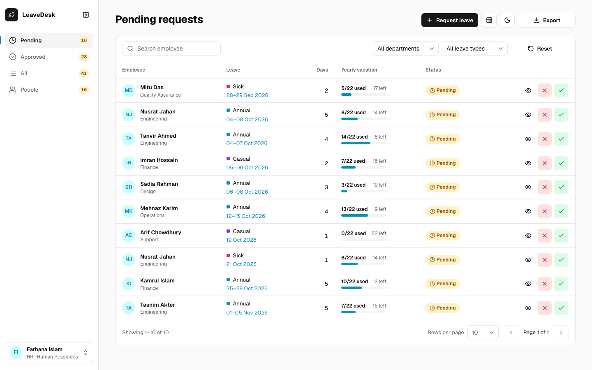

## What it does

- **Two roles.** Employees request leave; HR decides. The first account ever created becomes HR, and everyone in the Human Resources department is HR.
- **Requesting leave.** An employee picks dates on a calendar. Fridays and Saturdays are never counted, and the form shows the working days and the balance left before sending.
- **Deciding.** HR approves or rejects from the Pending table or a review page, with an optional note. A toast offers **Undo** for 5 seconds.
- **Balances.** Each person has a yearly allowance per type (Annual 16, Casual 3, Sick 3 by default). Approved days count as used, and waiting days as pending.
- **Team view.** The Team calendar (the calendar icon in each list page's header) shows who is away each day, and every HR table exports to CSV.
- **People.** HR sets each person's department, salary (with history) and per-person leave limits. Every change is written to an audit log.
- **Sign-in** with email and password, or optionally Google. The session is an httpOnly cookie, and the Go API enforces every rule.

<details>
<summary>Full feature list</summary>

| Employee | HR |
|---|---|
| **My leave:** available days in total and per type, with used and pending shown on the bars | **Pending:** every waiting request, with each person's yearly "8/22 used" bar |
| **Request leave:** a month picker that never counts Fri or Sat, a live working-day count, and the same checks as the server | **Approve / Reject** from the table or the review page, with an optional note and 5 seconds to **Undo** |
| **Attachments:** a PDF, PNG or JPG up to 5 MB, previewed in the page | **Review page:** employee card, "If approved: N days left", teammates away on the same dates, the attachment |
| **Edit or cancel** a request while it is pending; **Request again** after a rejection | **Approved** and **All** tables with search and filters, and CSV **Export** |
| **History** of decided requests with HR's note | **People:** department, salary with history, and per-person leave limits (never below the days already used) |
| **Team calendar** (header icon) showing who is away each day | The same calendar, filtered by department or leave type |
| **Profile:** photo (JPG or PNG up to 2 MB), name, date of birth, password. Google-only accounts can **set a password** | The same profile page. HR can't change anyone's name, email, date of birth, password or joining date, nor their own salary or limits |

**Everywhere:**
- Calendar and light/dark theme icons in the page header.
- A sidebar that collapses to icons (button or Ctrl/Cmd+B) and remembers the choice. List items show their count (Pending 10, Approved 28, …).
- Tables page with chevron icon buttons (Previous / Next page).
- A bottom tab bar on phones.
- Keyboard focus rings and tooltips on every icon button.

**Salary** is visible to HR only. **Every HR change** writes an audit-log row. **Decisions held for Undo** are still sent if the tab closes, using `fetch keepalive`.

</details>

## Screenshots

| HR | Employee |
|---|---|
| 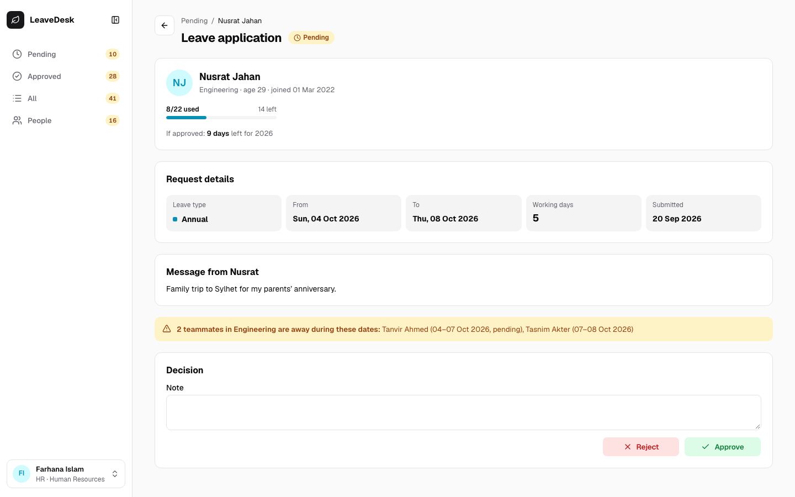<br>**Review:** who is asking, how many days are left, and which teammates are away on the same dates. | 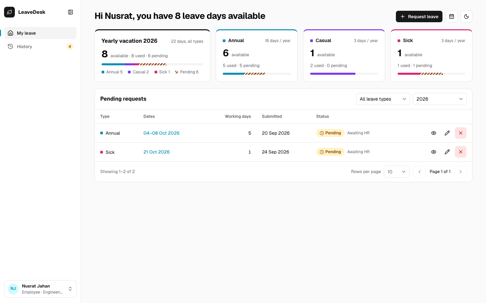<br>**My leave:** available days in total and per type, with pending requests below. |
| 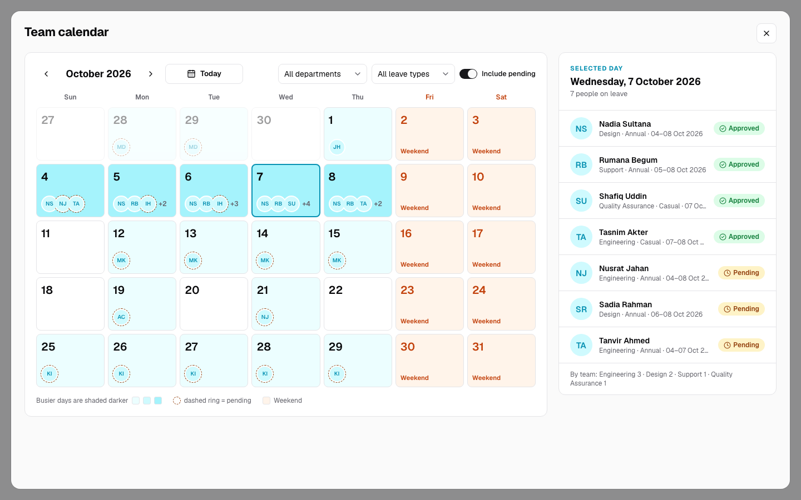<br>**Team calendar:** who is away each day; pending leave has a dashed ring. | 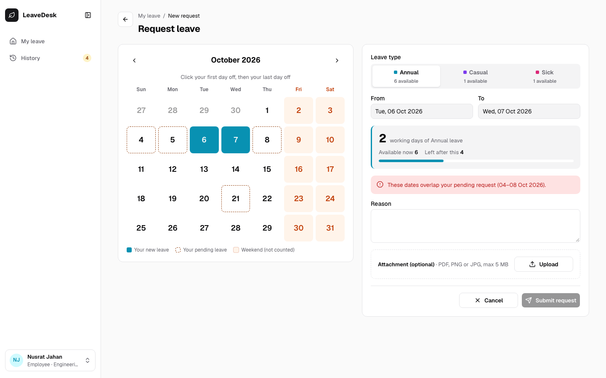<br>**Request leave:** the form explains a problem before anything is sent. |

<p>
  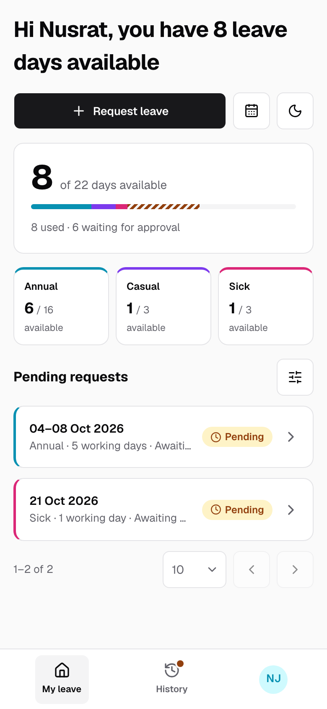
  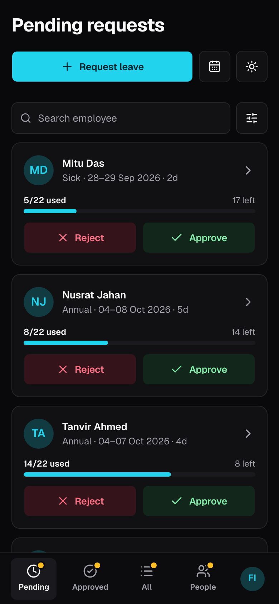
</p>

On phones, the sidebar becomes a bottom tab bar and tables become cards. Both themes work everywhere.

<details>
<summary>More screenshots</summary>

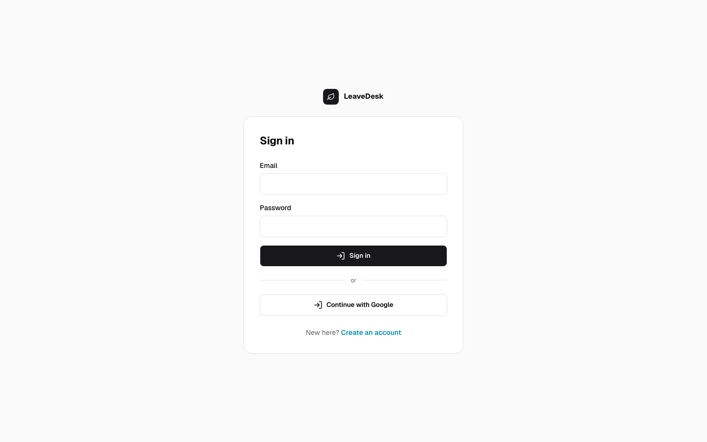
**Sign in.**

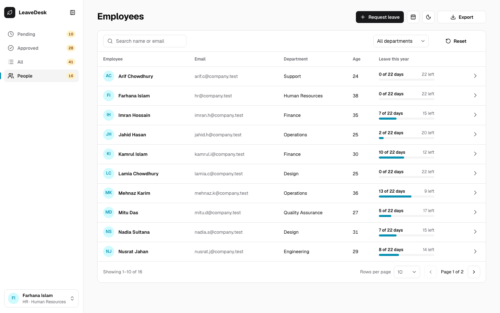
**People:** everyone's leave this year, searchable and filterable by department.

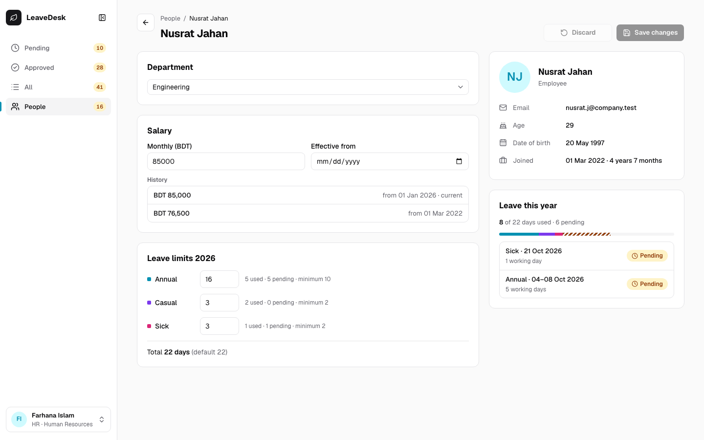
**Employee page:** department, salary history and this year's leave limits, which can't go below the days already used.

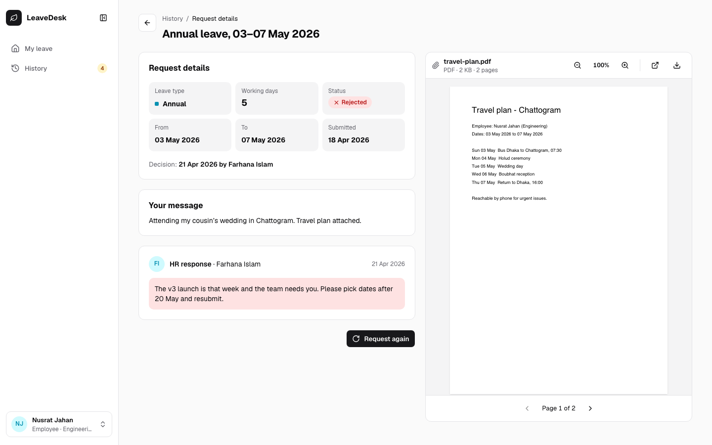
**Request details:** HR's note and an in-page PDF preview of the attachment.

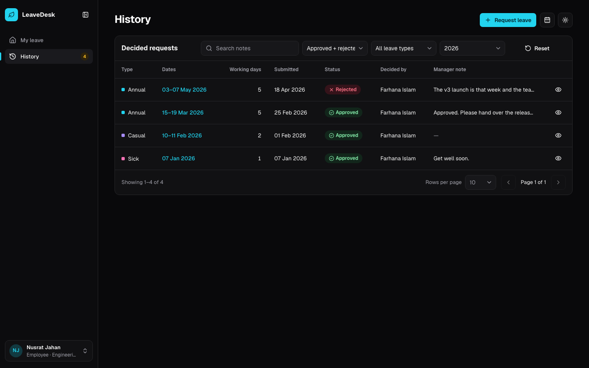
**History** in the dark theme.

</details>

## Quick start

You need Docker Desktop, or Docker Engine with the compose plugin.

```bash
cp .env.example .env
```

Open `.env` and set `JWT_SECRET` to a long random string (`openssl rand -hex 32` makes one). Then:

```bash
make up      # docker compose up --build -d
make seed    # loads the demo company (replaces all existing data)
```

Open **http://localhost:3000** and sign in. Every demo password is `password123`.

| Role | Email | Notes |
|---|---|---|
| HR | `hr@company.test` | Farhana Islam |
| Employee | `nusrat.j@company.test` | 8 days available, a pending request for 04–08 Oct, and a rejected request with a PDF |
| Employee | `rakib.h@company.test` | Joined this week, no leave history yet |

The seed also creates 13 more employees in 7 departments. The week of 04–08 Oct 2026 is busy.

**Without the demo data**, the database starts empty. While no HR exists, the Register page says so, and the first account created becomes HR. Everyone after that is an employee.

**Promoting someone to HR.** Moving a person into the Human Resources department on the People page makes them HR, and moving them out makes them an employee again. The last HR can't be moved out. You can also use the command line:

```bash
docker compose exec backend /app/leavedesk promote --email someone@company.test
docker compose exec backend /app/leavedesk demote --email someone@company.test
```

`demote` refuses to remove the last HR. Other commands: `make down` stops the stack, `make logs` follows the API log, and `make reset` deletes the database and uploaded files.

## Configuration

Every setting comes from `.env` (copied from `.env.example`). Only `JWT_SECRET` is required: the stack refuses to start without it.

| Variable | Default | What it does |
|---|---|---|
| `JWT_SECRET` | none (required, 16+ characters) | Signs the session cookie |
| `SESSION_TTL` | `8h` | How long a sign-in lasts |
| `COOKIE_SECURE` | `false` | Set to `true` when the app is served over HTTPS |
| `APP_TIMEZONE` | `Asia/Dhaka` | Decides which calendar day "today" is |
| `LEAVE_DEFAULT_ANNUAL` / `_CASUAL` / `_SICK` | `16` / `3` / `3` | Default yearly allowance per type; HR can override it per person and year |
| `ALLOWED_EMAIL_DOMAINS` | empty (any domain) | Comma-separated domains allowed to sign up, and to use Google sign-in |
| `GOOGLE_CLIENT_ID`, `GOOGLE_CLIENT_SECRET`, `GOOGLE_REDIRECT_URL` | empty; redirect `http://localhost:3000/api/auth/google/callback` | Optional Google sign-in (see below) |
| `POSTGRES_DB`, `POSTGRES_USER`, `POSTGRES_PASSWORD` | `leavedesk`, `leavedesk`, `leavedesk_secret` | The database the stack creates |
| `FRONTEND_PORT` | `3000` | The port the app is published on |

After changing `.env`, run `make up` again; Compose recreates the containers whose settings changed.

## Local development

To work on the UI with instant reload, keep the stack running and start Vite, which forwards `/api` to it the way nginx does:

```bash
cd frontend
npm install
API_PROXY=http://localhost:3000 npm run dev    # http://localhost:5173
```

`npm run build` type-checks and builds, and `npm run lint` runs oxlint. The Go API is built inside Docker (`make up`). `make test` runs `go vet` and the Go tests in a Go 1.23 container, so a local Go install isn't needed.

## Tech stack and why

| Layer | Choice | Why |
|---|---|---|
| API | Go 1.23, standard library `net/http` | Go 1.22 route patterns (`POST /api/requests/{id}/decision`) cover every route, so there is no framework to learn |
| Database | PostgreSQL 16, `pgx/v5` v5.7.1, hand-written SQL | Foreign keys, CHECK constraints, date maths and advisory locks for the concurrency rules |
| Migrations | `golang-migrate/v4` v4.18.1, SQL embedded in the binary | They run on startup, so there are no manual steps |
| Auth | bcrypt (`x/crypto` v0.28.0), `golang-jwt/jwt/v5` v5.3.1 (HS256), Google OpenID Connect | Salted password hashes, and a stateless signed session in an httpOnly cookie |
| UI | React 19.2, TypeScript 7 (strict), React Router 7, Vite 8 | Typed components and client-side routing with a fast build |
| Server data | TanStack Query 5, TanStack Table 8 | Caching, refetching after changes, and server-paged tables without hand-written loading code |
| Components | shadcn/ui 4 on Radix, Tailwind CSS 4, lucide icons, Geist font | Accessible building blocks; every colour is a light/dark design token |
| Dates, PDF, toasts | date-fns 4, react-pdf 11, sonner 2 | Fri/Sat working-day maths, an in-page PDF preview, and the Undo toast |
| Serving | nginx (`nginx:alpine`), Node 20 build image | Serves the built UI and proxies `/api` on the same origin, so no CORS is needed |
| Tests | Go `testing`, Node's built-in test runner, Playwright 1.63 | Unit tests with no extra framework, and browser tests in real Chrome |

## Architecture

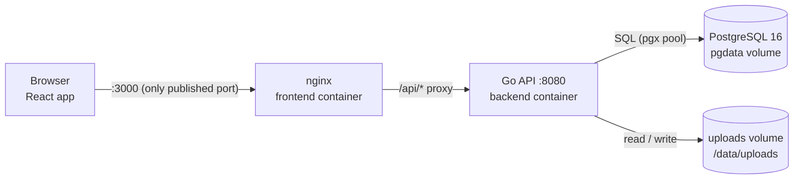

How one request travels, for example HR approving a request:

1. The browser sends `POST /api/requests/{id}/decision` with the `ld_session` cookie; JavaScript never sees the token.
2. nginx forwards it to the Go API, which logs it, verifies the cookie and **reloads the user from Postgres**, so a role change or deleted account applies at once. Non-HR users get `403`.
3. The handler decodes the body and calls `leave.Service.Decide`, which checks the rules: HR only, not your own request, and still pending.
4. The store runs `UPDATE … WHERE id = $1 AND status = 'pending'`. If another HR decided first, nothing changes and the answer is `409 NOT_PENDING`.
5. The API returns JSON, and the UI refreshes every list, balance and calendar that shows this request.

| Container | Image | Job |
|---|---|---|
| `db` | `postgres:16-alpine` | The database; its healthcheck gates the backend |
| `backend` | `golang:1.23-alpine` build → `alpine:3.20`, non-root | The `leavedesk` binary: runs migrations on start, stores files in the `uploads` volume |
| `frontend` | `node:20-alpine` build → `nginx:alpine` | Serves the UI and proxies `/api/`; nginx allows 6 MB bodies for 5 MB attachments |

The full explanation (components, middleware, errors, database, Docker) is in [docs/EXPLANATION.md](docs/EXPLANATION.md).

## Business rules

- **Working days.** A request counts the days from start to end that are not Friday or Saturday. The same function exists in Go (`leave.WorkingDays`) and TypeScript (`lib/leave.ts`), with the same test cases.
- **Balance maths.** `available = limit − used (approved) − pending`. The limit is the default from `.env` unless HR set one for that person and year. A request counts against the year it starts in.
- **Validation order** (the first failure wins): type → both dates → start ≤ end → at least one working day → reason length → no overlap with your own pending or approved leave → enough balance. Messages are exact, for example `Not enough Annual leave: 6 days available, 9 requested.`
- **Self-approval.** Nobody decides their own request. HR's own requests appear in Pending with the buttons disabled and wait for another HR.
- **First account becomes HR.** Registration takes an advisory lock, checks whether any HR exists, and makes the new account HR only if none does, so two people signing up at once can't both become HR.
- **Only pending requests** can be edited, cancelled or decided. Create and edit run under a per-user lock, so two submissions at the same moment can't both pass the balance check.

## Google sign-in (optional)

Email and password always work. The "Continue with Google" button appears only when both `GOOGLE_CLIENT_ID` and `GOOGLE_CLIENT_SECRET` are set.

1. In Google Cloud Console, set up the OAuth consent screen as **External** in **Testing** mode and add your test users. Then create a **Web application** client with:
   - Authorised JavaScript origin: `http://localhost:3000`
   - Authorised redirect URI: `http://localhost:3000/api/auth/google/callback`

   Keep the downloaded `client_secret_*.json` outside the repo.
2. Put the values in `.env`, which git ignores:

   ```bash
   GOOGLE_CLIENT_ID=<client ID>
   GOOGLE_CLIENT_SECRET=<client secret>
   GOOGLE_REDIRECT_URL=http://localhost:3000/api/auth/google/callback
   ALLOWED_EMAIL_DOMAINS=
   ```

3. Run `docker compose up -d --force-recreate backend`.

An existing account with the same email is linked on its first Google sign-in. A new person finishes sign-up by entering only a date of birth, because Google doesn't share it. In Testing mode, only listed test users can sign in. If `ALLOWED_EMAIL_DOMAINS` is set, personal Gmail accounts are refused, because they have no hosted domain.

For `npm run dev` on port 5173, register `http://localhost:5173/api/auth/google/callback` as well and set `GOOGLE_REDIRECT_URL` to it. The whole flow is explained in [docs/EXPLANATION.md](docs/EXPLANATION.md#9-google-sign-in).

## Testing

| Command | What it covers |
|---|---|
| `make test` | `go vet` and the Go unit tests, run in a Go container: rules, services, sessions, config, files and the HTTP layer with fake stores |
| `cd frontend && npm test` | Frontend unit tests with Node's built-in runner: date and balance helpers, hooks, the Undo store, components and the auth pages |
| `make e2e` | Browser tests with Playwright in your installed Chrome, against a separate stack on :3100 with a freshly seeded database. Your own data is never touched |
| `make e2e-down` | Deletes the e2e stack and its database |

`cd frontend && npm run e2e:report` opens the last e2e report, with a trace and screenshot for any failure.

## Project structure

```
backend/           Go API: cmd/leavedesk (serve, seed, promote, demote), internal/* packages, SQL migrations
frontend/          React app: src/ (api, components, features, layouts, lib), e2e/ Playwright tests, nginx.conf
docs/              EXPLANATION.md and the README screenshots
tools/screenshots/ The script that takes those screenshots from the running app
docker-compose.yml The three containers: db, backend, frontend
Makefile           Shortcuts: up, down, seed, test, e2e, screenshots
.env.example       Every setting, with comments; copy it to .env
```

## Known limitations

- There are no email notifications; people check the app for decisions.
- There is no deactivation or offboarding flow, and no approval step for new accounts. Set `ALLOWED_EMAIL_DOMAINS` to restrict sign-ups to the company's domain.
- There is a single approval step (employee → HR), with no team-lead step. With only one HR, HR's own requests wait until a second HR exists.
- There is no password reset. By design HR can't change passwords, so a forgotten password needs a database operator.
- There are no public holidays: only Fridays and Saturdays are skipped.
- A request that crosses New Year counts entirely against the year it starts in.
- The audit log is written for every HR change but isn't shown in the UI yet.

## Regenerating screenshots

```bash
make up && make seed && make screenshots
```

`make seed` replaces all data with the demo company. To keep your own data, point the script at another stack that has the demo data: `BASE_URL=http://localhost:3100 make screenshots`. The script only opens pages, so running it twice gives identical images.

## API reference

All endpoints are under `/api`. Errors look like `{"error": "CODE", "message": "human text"}`, with status 400 (validation), 401, 403, 404, 405 (wrong method) or 409 (conflict).

| Method & path | Who |
|---|---|
| `GET /health` | public |
| `GET /auth/bootstrap` · `POST /auth/register` · `POST /auth/login` · `POST /auth/logout` | public |
| `GET /auth/google/start` · `GET /auth/google/callback` · `GET /auth/google/pending` · `POST /auth/google/complete` | public (only when configured) |
| `GET /me` · `PATCH /me` · `POST /me/password` · `GET /me/balances?year=` | signed in |
| `GET /requests?scope=mine\|all&status=&type=&department=&q=&from=&to=&year=&page=&pageSize=` | signed in (`scope=all`: HR) |
| `POST /requests` (JSON or multipart with `attachment`) · `GET /requests/{id}` · `PATCH /requests/{id}` · `POST /requests/{id}/cancel` | signed in; owner or HR |
| `POST /requests/{id}/decision` · `GET /requests/{id}/overlaps` · `GET /requests/export.csv` | HR |
| `GET /calendar?month=2026-10&department=&type=&includePending=` | signed in (never returns balances) |
| `GET /hr/employees` · `GET /hr/employees/{id}` · `PATCH /hr/employees/{id}` · `GET /hr/employees/export.csv` | HR |
| `GET /departments` (signed in) · `POST /departments` (HR) | |
| `POST /files` · `GET /files/{id}` | signed in; files go to the owner or HR, avatars to anyone signed in |
