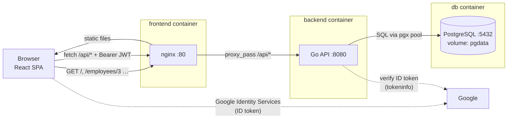
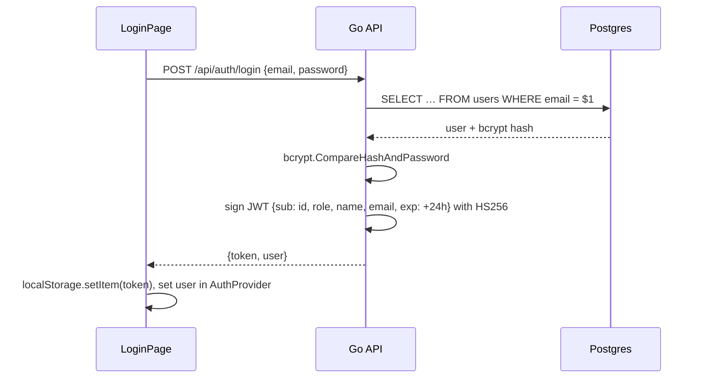
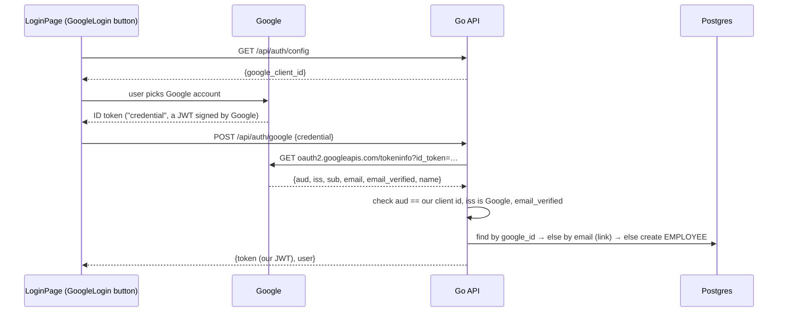
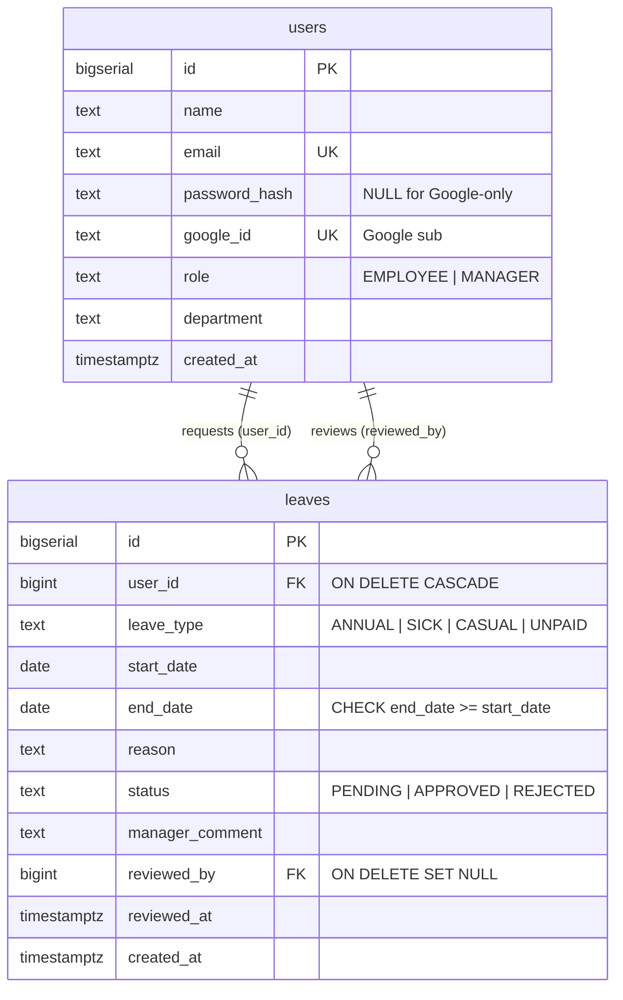

# Employee Leave Tracker: Written Explanation

This document explains four things: how the app is put together, what each important piece of code does, what happens inside the API when a request arrives, and how Docker runs it all.

## Contents

1. [Architecture: how the frontend and backend interact](#1-architecture-how-the-frontend-and-backend-interact)
2. [Key code components and their purpose](#2-key-code-components-and-their-purpose)
3. [How the API works internally](#3-how-the-api-works-internally)
4. [Authentication: JWT and Google sign-in](#4-authentication-jwt-and-google-sign-in)
5. [Database design](#5-database-design)
6. [Frontend internals](#6-frontend-internals)
7. [Docker setup](#7-docker-setup)
8. [Design decisions and trade-offs](#8-design-decisions-and-trade-offs)

---

## 1. Architecture: how the frontend and backend interact



The app is a **single-page application (SPA)** backed by a **JSON REST API**:

1. The browser loads the React app from nginx. After that, React Router changes pages in the browser without reloading.
2. Every piece of data comes through one typed interface, `LeaveApi` (`src/api/contract.ts`). Pages never call `fetch`; they use TanStack Query hooks, which call `api.listRequests(...)`, `api.decideRequest(...)` and so on.
3. `api` is chosen once at build time. With `VITE_USE_MOCK=true` (the default for now) it is `mockApi`, an in-memory backend with seed data and the same business rules. With `VITE_USE_MOCK=false` it is the `fetch` client, which sends requests to relative URLs like `/api/requests`. The Go API still implements the earlier contract, so the real client is waiting on those endpoints (see "Backend status" in the README). In real mode the page and the API share **one origin** (`localhost:3000`), so:
   - nginx forwards `/api/*` to the Go container (`proxy_pass http://backend:8080`);
   - the browser sees no cross-origin request, so no CORS headers are needed;
   - only the frontend port is published, and the API and database are unreachable from outside Docker.
4. After login, the browser stores a JWT and sends it on every call as `Authorization: Bearer <token>`. The backend keeps no session table. The signed token proves who the caller is, and the middleware then loads that user, so the role is always current.
5. The API answers with JSON. Errors always have the shape `{"error": "message"}`, so the frontend can show `err.message` in a toast or form.

## 2. Key code components and their purpose

### Backend (`backend/`)

The backend is layered. Each layer only knows about the one below it:

```
handler  (HTTP: parse request, write JSON)       ← knows HTTP, not SQL
   ↓
service  (business rules, validation)            ← knows rules, not HTTP or SQL
   ↓  via interfaces UserStore / LeaveStore
repository (SQL only)                            ← knows SQL, not rules
   ↓
PostgreSQL
```

| File / package | Purpose |
|---|---|
| `cmd/api/main.go` | Entry point. It loads config, connects to the DB (with retries), runs migrations, seeds data and **wires the layers together**: repositories → services → handler. It starts the HTTP server and shuts it down gracefully on `SIGTERM` (`docker stop`). |
| `internal/config` | Reads every setting from environment variables (`DATABASE_URL`, `JWT_SECRET`, `GOOGLE_CLIENT_ID`, …) and fails fast if something required is missing. |
| `internal/database` | Opens the `pgxpool` connection pool. It retries because Postgres may still be starting, then applies the SQL files embedded with `//go:embed`. |
| `internal/model` | Domain types: `User`, `Leave`, `Role`, `LeaveStatus`, and `Date`, which maps a Postgres `DATE` to and from `"YYYY-MM-DD"` JSON. Also the **error kinds** (`ErrInvalid`, `ErrNotFound`, `ErrConflict`, …) that services return. |
| `internal/repository` | All SQL, always parameterised (`$1`, `$2`). It turns driver errors into domain errors: "no rows" becomes `ErrNotFound` and "unique violation" becomes `ErrConflict`. |
| `internal/service` | Business rules. `AuthService` handles login and Google login. `EmployeeService` handles employee CRUD and details. `LeaveService` handles apply, cancel, review, lists and the dashboard. Services depend on the **interfaces** in `stores.go`, not on the concrete repositories. |
| `internal/handler` | One method per endpoint. It decodes JSON, calls a service and writes JSON. `router.go` registers the routes and wraps them in middleware. `handler.go` maps error kinds to HTTP status codes. |
| `internal/middleware` | `Logger` (method, path, status, duration), `Recover` (a panic becomes a 500), `Authenticate` (JWT → user → context) and `RequireRole` (a 403 if the role is wrong). |
| `internal/auth` | `password.go` (bcrypt), `jwt.go` (issue and parse HS256 tokens), `google.go` (verify Google ID tokens). |
| `internal/seed` | Creates the first manager from env vars and, optionally, demo employees and leaves. It only runs on an empty DB. |

### Frontend (`frontend/src/`)

| File / folder | Purpose |
|---|---|
| `types.ts` | Domain types (`Employee`, `LeaveRequest`, `Balance`, `Policy`, …) shared by the API layer and the UI. |
| `api/contract.ts` | The `LeaveApi` interface: every call the UI can make, plus `ApiError(message, status)`. |
| `api/http.ts`, `api/auth.ts`, `api/requests.ts`, … | The real client: `request()` adds `Authorization: Bearer <jwt>`, parses JSON and turns `{"error"}` responses into `ApiError`; one small file per resource maps each method to a REST path. |
| `api/mock.ts`, `api/mockData.ts` | In-memory implementation of the same interface: 14 employees, 2026 leave history, fake JWTs, and the server rules (ownership, overlap, balance, pending-only changes, HR-only decisions, no balances for employees on the calendar). |
| `api/queries.ts`, `api/invalidate.ts` | Query keys in one place, shared hooks (`usePolicy`, `useBalances`, `useRequestDetail`), and one function that refreshes every request/balance/calendar query after a change. |
| `features/*/hooks.ts` | Page-level TanStack Query hooks: `useRequestRows`, `useDecide` (approve/reject + Undo toast), `useMyRequests`, `useSaveRequest`, `useCancelRequest`, `useCalendar`, `useProfile`. |
| `features/auth/` | `AuthProvider` keeps the JWT and loads `/auth/me`; `guards.tsx` has `RequireAuth` and `RequireRole` (role read from the JWT); `LoginPage`. |
| `features/manager/`, `employee/`, `calendar/`, `profile/` | The pages, plus their columns, cards and dialogs. |
| `components/Button.tsx` | The only button: `labeled` (exactly 140×36 on desktop, 44/48 tall full-width on mobile) or `icon` (36/44 square with aria-label + tooltip); variants primary/secondary/ghost/ok/danger; `loading` swaps the icon for a spinner and disables it. |
| `components/DataTable.tsx` | The one table pattern: toolbar with filters, sortable headers, checkbox selection + bulk bar, pagination footer, 6-row skeleton, empty/error states. Below 768px the same rows render as cards, filters move to a bottom sheet and show as chips. |
| `components/*` | `StatusBadge`, `LeaveTypeTag`, `Avatar`, `BalanceBar`, `StackedBar`, `PageHeader`, `Card`, `Alert`, `StickyBar`, … |
| `layouts/AppShell.tsx` | Desktop top bar (role-based nav with the pending count, theme toggle, avatar menu); mobile app bar + bottom tab bar; sub-pages swap the logo for a back button. |
| `lib/dates.ts`, `lib/leave.ts` | Date formats that always include the year; `workingDays` (Fri + Sat excluded), `available`, `overlaps`. |
| `lib/theme.ts`, `index.css` | Light/dark theme (`.dark` on `<html>`, saved in localStorage, default from `prefers-color-scheme`); every colour is a CSS variable token mapped into Tailwind. |
| `components/ui/*` | shadcn/ui components generated by the shadcn CLI. |

## 3. How the API works internally

### 3.1 Routing

Go 1.22 added method and wildcard patterns to the standard `http.ServeMux`, so no router library is needed:

```go
mux.Handle("POST /api/leaves",              employeeOnly(h.ApplyLeave))
mux.Handle("PATCH /api/leaves/{id}/status", managerOnly(h.ReviewLeave))
```

- A request with the wrong method gets `405 Method Not Allowed` automatically.
- `r.PathValue("id")` reads the `{id}` wildcard.
- `anyUser` wraps a handler in `Authenticate`. `employeeOnly` and `managerOnly` add `RequireRole(EMPLOYEE)` or `RequireRole(MANAGER)` after it.
- Filing and cancelling leave is **employee-only**, so a manager can never approve their own request.

### 3.2 The middleware chain

Every request passes through this chain:

```
Logger → Recover → ServeMux → [Authenticate → RequireRole] → handler
```

| Step | What it does | Can stop the request with |
|---|---|---|
| `Logger` | Wraps the `ResponseWriter` to record the status code, then logs `PATCH /api/leaves/6/status 200 1.2ms` | – |
| `Recover` | `defer recover()`, so a bug in one handler returns a 500 instead of crashing the server | 500 |
| `ServeMux` | Matches method and path | 404 / 405 |
| `Authenticate` | Reads `Authorization: Bearer …` and verifies the signature, algorithm, issuer and expiry. It then loads the user by id (one primary-key lookup): a deleted account gets 401, and the role is taken from the database, not the token. Stores the claims in `context` | 401 |
| `RequireRole` | Compares `claims.Role` with the required role | 403 |

### 3.3 Inside a handler → service → repository call

Here is `POST /api/leaves` (apply for leave) step by step:

1. **Handler** (`leave_handler.go: ApplyLeave`)
   - `decodeJSON` limits the body to 1 MB and calls `DisallowUnknownFields()`. A typo like `"leaveType"` is therefore rejected, not silently ignored.
   - `model.Date.UnmarshalJSON` rejects dates that are not `YYYY-MM-DD` (for example `2026-13-01`) with a `400`.
   - The user id comes from the **JWT claims** (`currentUserID(r)`), never from the request body, so nobody can apply on someone else's behalf.
2. **Service** (`leave_service.go: Apply`)
   - Validates the type, that both dates are present, that `end ≥ start`, that the start is not in the past (sick leave is the exception), and that the reason is present and at most 500 characters.
   - "Today" comes from an injected `now()` function in the company timezone (`APP_TIMEZONE`). Tests can freeze time this way.
   - Calls `HasOverlap`. An overlap returns a `Conflict` error, which becomes `409`.
   - **Race protection.** Two simultaneous requests could both pass `HasOverlap` before either inserts. Migration `002_no_overlapping_leaves.sql` therefore adds a Postgres **exclusion constraint** (`EXCLUDE USING gist (user_id WITH =, daterange(start_date, end_date, '[]') WITH &&) WHERE status IN ('PENDING','APPROVED')`). The loser gets error `23P01`, which the repository maps to the same `409`. In a test, 8 identical concurrent requests produced exactly one `201` and seven `409`s.
3. **Repository** (`leave_repository.go`)
   - `HasOverlap` runs `EXISTS(… start_date <= $3 AND end_date >= $2 AND status IN ('PENDING','APPROVED'))`. Two ranges overlap exactly when each one starts before the other ends.
   - `Create` runs `INSERT … RETURNING id`, then reloads the row joined with `users`, so the response includes `employee_name` and the computed `days`.
4. **Handler** writes `201 Created` and the new leave as JSON.

### 3.4 Error handling end to end

Services never mention HTTP. They return a `*model.Error{Kind, Message}` (or a wrapped internal error), and one function, `handler.writeError`, converts that to a response:

| Error kind | HTTP status | Example |
|---|---|---|
| `ErrInvalid` | 400 | "end_date cannot be before start_date" |
| `ErrUnauthorized` | 401 | "invalid email or password" |
| `ErrForbidden` | 403 | "this is not your leave request" |
| `ErrNotFound` | 404 | "employee not found" |
| `ErrConflict` | 409 | "only PENDING leaves can be reviewed" |
| anything else | 500 | logged on the server; the client only sees "internal server error" |

`errors.Is` works through `Unwrap()`, so wrapping with `fmt.Errorf("context: %w", err)` keeps the kind while adding context for the logs.

### 3.5 Concurrency-safe status changes

Approving or rejecting is a single SQL statement:

```sql
UPDATE leaves SET status = $1, manager_comment = $2, reviewed_by = $3, reviewed_at = now()
WHERE id = $4 AND status = 'PENDING'
```

Postgres locks the row during the update. If two managers click at the same time, the first one changes the row. The second one's `WHERE status='PENDING'` no longer matches, so 0 rows change and the service returns `409 Conflict`. There is no "read, check, then write" gap for a race to slip through. Cancelling works the same way with `DELETE … WHERE id=$1 AND user_id=$2 AND status='PENDING'`. The `user_id` condition also stops an employee from cancelling someone else's request.

### 3.6 Dashboard queries

`GET /api/dashboard?date=2026-09-24` makes four small queries:

| Number | SQL idea |
|---|---|
| Pending / approved / rejected | One scan with conditional aggregation: `COUNT(*) FILTER (WHERE status='PENDING')`, … |
| Requests received that day | `WHERE (created_at AT TIME ZONE 'Asia/Dhaka')::date = $date` |
| On leave that day | `COUNT(DISTINCT user_id) WHERE status='APPROVED' AND $date BETWEEN start_date AND end_date` |
| Employees | `COUNT(*) FROM users WHERE role='EMPLOYEE'` |

**Why the timezone matters:** `created_at` is stored in UTC. A request sent at 01:00 in Dhaka on 25 September is still 24 September in UTC. Converting to the company's timezone before taking the date means "requests received today" matches what the manager sees on their calendar.

The employee list (`GET /api/employees`) uses the same `FILTER` trick with a `LEFT JOIN leaves … GROUP BY u.id`. One query returns every employee with their pending, approved and rejected counts, which avoids one query per employee (the "N+1" problem).

## 4. Authentication: JWT and Google sign-in

### 4.1 Password login



- Passwords are stored as **bcrypt** hashes. bcrypt is slow on purpose and salted, so a leaked table cannot be reversed quickly.
- A wrong email and a wrong password return the **same** message, so an attacker cannot tell which emails exist.
- The JWT holds the user id in `sub` and the `role`. The server signs it with `JWT_SECRET`. Nobody can change `role` to `MANAGER` without breaking the signature.
- `Parse` only accepts `HS256` (`WithValidMethods`), which blocks the classic `alg: none` trick. It also checks `exp` and `iss`.

### 4.2 Google sign-in



Key points:

- The frontend **never** trusts the Google token on its own. The backend verifies it, and it checks `aud` (audience), because a valid Google token issued for *some other* app must be rejected.
- After verification the backend issues **its own JWT**. From then on, Google users and password users are identical to the rest of the system.
- Account linking works like this:
  1. Look up the user by Google `sub`.
  2. If that fails, look up the user by email and link the account. A manager can create an employee without a password, and the employee then signs in with Google.
  3. If that also fails, create a new `EMPLOYEE`. Emails listed in `MANAGER_EMAILS` become `MANAGER`. With `GOOGLE_AUTO_SIGNUP=false`, unknown emails get `403` instead.
- Linking never overwrites a *different* Google account that is already linked (`WHERE google_id IS NULL OR google_id = $1`). If two first-time sign-ins race, the loser's unique-violation is caught and the row the winner created is used.
- The client ID is served by `/api/auth/config` at runtime instead of being baked into the JS bundle at build time. Changing `.env` and restarting is therefore enough, with no image rebuild.

### 4.3 Using the token

- `api/http.ts` adds `Authorization: Bearer <token>` to every request.
- `AuthProvider` drops a stored token that is malformed or past its `exp`, then loads `/auth/me`. A 401 there signs the user out.
- `lib/jwt.ts` reads the `role` claim (without verifying it) so the router can show HR or employee pages; `RequireRole` redirects otherwise. The server still verifies the signature and role on every call.

## 5. Database design



- **Constraints in the database as well as in Go.** `CHECK` constraints on role, type, status and date order mean bad data cannot get in, even through a bug or a manual SQL session.
- `ON DELETE CASCADE` means deleting an employee removes their leaves. `ON DELETE SET NULL` keeps a leave's history if the manager who reviewed it is deleted.
- **Indexes** on `leaves(user_id)`, `leaves(status)` and `leaves(created_at)` match the filters the manager screens use.
- `days` is never stored. It is calculated as `end_date - start_date + 1` (Postgres date subtraction returns an integer), so it can never go stale.
- **No overlapping leaves** is enforced by the exclusion constraint described in §3.3 (needs the `btree_gist` extension, which ships with Postgres).
- **Migrations.** The files in `migrations/` are embedded in the binary and run in name order on every start. They are idempotent (`IF NOT EXISTS`, or a `DO` block that checks `pg_constraint`), so running them again is harmless. For a bigger project I would switch to a versioned tool such as `golang-migrate`.

## 6. Frontend internals

**Routing and guards** (`routes.tsx`):

```
/login                         LoginPage
<RequireAuth>                  must be signed in
  <AppShell>                   top bar / tab bar by role
    /                          → /hr/pending (hr) or /me (employee)
    <RequireRole role="hr">
      /hr/pending /hr/approved /hr/requests /hr/requests/:id
    <RequireRole role="employee">
      /me /me/history /me/request/new(?edit=ID|?from=ID) /me/requests/:id
    /calendar  /profile        both roles
```

**Data loading.** Pages use TanStack Query hooks. Each hook has a query key that includes its inputs, for example `['requests', { status: 'pending', department: 'Finance' }]`. TanStack Query caches results per key, removes duplicate requests, keeps the previous rows on screen while new filters load (`placeholderData`), and ignores responses that arrive for an old key. Every page handles the same three states: a skeleton while loading, `ErrorState` with **Try again**, and `EmptyState` with one relevant button.

**After a change.** Mutations (`useDecide`, `useSaveRequest`, `useCancelRequest`, …) call `invalidateLeaveData()`, which marks request lists, details, balances and the calendar as stale, so every mounted view refetches. Approve and reject have no confirm dialog. The decision happens at once, and the toast offers **Undo** for 5 seconds, which calls `reopenRequest`.

**The request form.** `RequestLeavePage` keeps `start`, `end`, `type`, `reason` and `attachment` in state. The month picker only shows the employee's own data: the selected range, their pending leave as a dashed amber border, and Fri/Sat weekend cells. Working days, "available now" and "left after this" are computed on every render from `workingDays()` and the balance query. Validation is done twice: the form shows overlap, balance and no-working-day errors instantly and disables Submit, and the API (mock or Go) repeats every rule, because client-side checks can be bypassed.

**Design system.** All colours are tokens in `index.css` (`--bg`, `--surface`, `--primary`, `--ok-fg`, `--type-annual`, …), defined for light under `:root` and for dark under `.dark`, then mapped into Tailwind names such as `bg-surface` and `text-pending`. The two themes change colours only, never sizes. Status colours (amber, green, red) and leave-type colours (cyan, violet, pink) are separate systems.

**Mobile.** `useIsMobile()` (below 768px) switches `DataTable` to cards, the shell to an app bar + tab bar, and detail pages to sticky bottom action bars. Touch targets are at least 44px.

## 7. Docker setup

### 7.1 Services (`docker-compose.yml`)

| Service | Image | Port | Notes |
|---|---|---|---|
| `db` | `postgres:16-alpine` | internal 5432 | Data in the named volume `pgdata`, so it survives `docker compose down`. Healthcheck: `pg_isready`. |
| `backend` | built from `backend/Dockerfile` | internal 8080 (`expose`, not published) | `depends_on: db (service_healthy)`. Healthcheck: `wget /api/health`. Config comes from environment variables. |
| `frontend` | built from `frontend/Dockerfile` | **3000 → 80** | `depends_on: backend (service_healthy)`. The only container reachable from the host. |

- **Networking.** Compose creates a private network where each service is reachable by its name. nginx uses `http://backend:8080`, and the backend uses `db:5432` in `DATABASE_URL`.
- **Start-up order.** Healthchecks with `condition: service_healthy` start Postgres first, then the API, then nginx. The Go code also retries its DB connection 10 times, which helps outside Compose too.
- **Configuration.** `.env` (copied from `.env.example`) feeds the `${VAR:-default}` placeholders. `JWT_SECRET` uses `${JWT_SECRET:?…}`, so Compose refuses to start without it rather than running with a weak default.

### 7.2 Backend image: multi-stage build

```dockerfile
FROM golang:1.23-alpine AS build      # ~250 MB toolchain, used only to compile
COPY go.mod go.sum ./ ; RUN go mod download   # cached layer until dependencies change
COPY . . ; RUN CGO_ENABLED=0 go build -o /out/api ./cmd/api   # static binary

FROM alpine:3.20                      # small runtime image
RUN apk add ca-certificates tzdata    # HTTPS to Google + APP_TIMEZONE lookup
USER app                              # does not run as root
COPY --from=build /out/api /usr/local/bin/api
```

The final image contains only the binary and a few certificates and timezone files. The Go toolchain and source code are left behind.

### 7.3 Frontend image: build with Node, serve with nginx

```dockerfile
FROM node:20-alpine AS build ; RUN npm ci
ARG VITE_USE_MOCK=true                     # baked into the bundle at build time
RUN npm run build                          # tsc -b (type-check) + vite build → /app/dist
FROM nginx:alpine
COPY nginx.conf /etc/nginx/conf.d/default.conf
COPY --from=build /app/dist /usr/share/nginx/html
```

`docker-compose.yml` passes `VITE_USE_MOCK` from `.env` as a build argument. `nginx.conf` has these location blocks:

- `location /api/`: `proxy_pass http://backend:8080` (the reverse proxy).
- `location /assets/`: file names contain a content hash, so they are cached for one year. A nested `\.mjs$` block serves the pdf.js module worker as `application/javascript`, because nginx's `mime.types` has no `.mjs` entry and browsers refuse to run a module worker sent as `application/octet-stream`.
- `location /`: `try_files $uri /index.html`. A refresh on `/me/requests/LV-1851` returns the React app, and React Router then shows the right page. Without this, nginx would return 404.

## 8. Design decisions and trade-offs

| Decision | Why | Alternative I could mention |
|---|---|---|
| Standard-library `net/http` | Go 1.22 routing covers everything this app needs. Fewer dependencies to explain. | Gin, Echo or chi add route groups and binding helpers. |
| Handler / service / repository + interfaces | Each layer has one job, and services are unit-tested with fakes and no database | An ORM such as GORM would mean less SQL but more hidden behaviour. |
| JWT instead of server sessions, plus a user lookup per request | No session table. The lookup means deleted users and role changes take effect at once | A purely stateless JWT (no lookup) is faster but cannot be revoked before it expires. |
| JWT in `localStorage` | Simple, and works with a plain `Authorization` header | An `HttpOnly` cookie is safer against XSS but needs CSRF protection. |
| Google `tokeninfo` endpoint | A few lines, and Google does the signature check | Verify locally against Google's JWKS keys (`google.golang.org/api/idtoken`), which saves a network call per login. |
| nginx reverse proxy | Same origin, no CORS, API not exposed | Publish the API port and configure CORS. |
| Single team (every manager sees every employee) | Matches the brief and keeps queries simple | Add `manager_id` on users to support several teams. |

### Possible next steps

- Leave balances per type (for example 20 annual days a year) with a check when applying.
- Email notifications when a request is approved or rejected.
- Pagination on the request list.
- Refresh tokens with shorter-lived access tokens.
- Integration tests for repositories against a throwaway Postgres (testcontainers).
