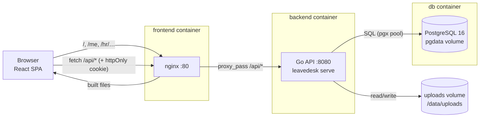

# LeaveDesk: Written Explanation

This document explains four things: how the app is put together, what each important piece of code does, what happens inside the API when a request arrives, and how Docker runs it all. The README has the setup steps.

1. [Architecture: how the frontend and backend interact](#1-architecture-how-the-frontend-and-backend-interact)
2. [Key code components](#2-key-code-components)
3. [How the API works internally](#3-how-the-api-works-internally)
4. [Business rules in detail](#4-business-rules-in-detail)
5. [Database](#5-database)
6. [Frontend internals](#6-frontend-internals)
7. [Docker setup](#7-docker-setup)
8. [Decisions, trade-offs and limitations](#8-decisions-trade-offs-and-limitations)

---

## 1. Architecture: how the frontend and backend interact



- **One origin.** The browser only ever talks to nginx on `localhost:3000`. nginx serves the React build and forwards `/api/*` to the Go container. There are no cross-origin calls, so no CORS setup is needed. The `SameSite=Lax` session cookie is sent automatically, and the API and database ports are never published.
- **SPA plus JSON API.** React Router changes pages in the browser. All data comes from `/api` as JSON. Errors always have the shape `{"error": "CODE", "message": "…"}`: the UI branches on `error` (for example `SELF_APPROVAL`) and shows `message` to the user.
- **Session.** Login sets `ld_session`, an httpOnly cookie holding an HS256 JWT (`sub`, `role`, 8-hour expiry). JavaScript cannot read it, so an XSS bug cannot steal it. Who is signed in comes from `GET /api/me`.
- **The server is the authority.** The UI checks dates, overlaps and balances as you type, for instant feedback. The API repeats every check and is the only thing that decides.

## 2. Key code components

### Backend (`backend/`)

```
cmd/leavedesk/main.go   serve | seed [--reset] | promote --email | demote --email
internal/config         environment → Config (secrets, limits, timezone, Google)
internal/domain         shared types (User, Date) and the error type {Status, Code, Message}
internal/auth           bcrypt, session cookie (JWT), Google OIDC verification
internal/account        register (first user → HR), login, profile, password, promote/demote
internal/leave          policy, WorkingDays, balances, validation, decisions, calendar  ← core rules
internal/hr             people, department/salary/limits, audit log
internal/files          uploads: type sniffing, size limits, permission to read
internal/store          all SQL (pgx); implements every service's Store interface
internal/httpapi        routes, middleware, thin handlers, JSON views, CSV export
internal/seed           demo data
migrations/             SQL files embedded in the binary, run with golang-migrate
```

| Component | Purpose |
|---|---|
| `leave/rules.go` | Pure functions with no I/O: `Validate` (the validation order and exact messages), `CanDecide` (HR, not self, pending), `CanChange` (owner, pending), `ValidateLimit` (floor), `Overlaps`. Table-driven tests cover each one. |
| `leave/service.go` | Applies the rules through a `Store` interface: create and edit inside `InUserLock`, atomic cancel and decide, lists, balances, teammates away. |
| `account/service.go` | `InitialRole(hasHR)` is the first-run rule (no HR yet → HR, otherwise employee). Also handles registration validation (18+, email domain, password), login (one error message for a bad email or a bad password), and Google account linking. |
| `hr/service.go` | The people directory. Validates all of PATCH `/hr/employees/{id}` first, then applies it in one transaction and writes the audit rows. |
| `store/*.go` | Parameterised SQL only. The `querier` interface lets the same methods run on the pool or inside a transaction. |
| `httpapi/server.go` | Route wrappers: `public`, `signedIn`, `hrOnly`. `fail()` maps errors to JSON. |

### Frontend (`frontend/src/`)

| Component | Purpose |
|---|---|
| `api/http.ts` | The only `fetch`. It sends cookies same-origin, turns error bodies into `ApiError(status, code, message)`, and reports a 401 to the auth provider, which shows Sign in. |
| `api/*.ts` | One module per resource (`auth`, `me`, `requests`, `hr`, `calendar`, `files`), grouped as `api.*`. |
| `api/queries.ts` | Query keys, shared hooks, and `refreshLeaveData()`, which marks every view of leave data stale after a change. |
| `features/auth/*` | `AuthProvider` (the `/me` query), route guards (signed in, guest, role), and the Sign in and Register pages. |
| `layouts/AppShell.tsx` | The 80px rail (bottom tab bar on mobile), amber "new" dots, and the account menu. |
| `layouts/HeaderActions.tsx` + `features/calendar/*` | Request leave, the Calendar toggle and Export, plus the Team calendar overlay, whose open state is remembered for the session. |
| `components/AppButton.tsx` | The only button: `labeled` (exactly 140×36 on desktop, full width at 44 or 48 on mobile and auth pages) or `icon` (36/44 square with aria-label and tooltip). Five variants. |
| `components/DataTable.tsx` | The one table pattern: filter toolbar, server paging and "Showing 1–8 of 23". On mobile it switches to cards with a filter sheet and chips. |
| `features/employee/*` | My leave, History, the request form (month picker, type picker, summary, attachment) and request details (with the PDF preview). |
| `features/hr/*` | Pending, Requests, Review, People, Employee details, and `decisions.ts` (Undo). |
| `lib/leave.ts` | `workingDays`, `available`, `overlaps`: the same rules as Go, with the same test cases. |
| `index.css` | Every colour as a light/dark CSS variable, mapped into Tailwind names. |

## 3. How the API works internally

### 3.1 Routing and middleware

Routes use the Go 1.22+ `ServeMux` patterns, for example `mux.Handle("POST /api/requests/{id}/decision", s.hrOnly(s.decideRequest))`. A wrong method gets 405 automatically, and `r.PathValue("id")` reads the wildcard. Every request passes through:

```
logRequests → recoverPanics → ServeMux → [withUser → role check] → handler
```

| Step | What it does | Fails with |
|---|---|---|
| `logRequests` | Writes one JSON line: method, path, status, milliseconds | – |
| `recoverPanics` | Turns a panic into a 500 instead of a crash | 500 |
| `withUser` | Verifies the cookie's JWT (HS256 only, issuer, expiry), then **reloads the user from Postgres**. A deleted account is locked out at once, and role or status changes apply on the next request | 401 |
| role check (`hrOnly`) | `role ≠ hr` → `FORBIDDEN` | 403 |

### 3.2 Handler → service → store

Here is `POST /api/requests`, an employee applying for leave:

1. **Handler.** It decodes JSON with a 1 MB limit and unknown fields rejected. For `multipart/form-data`, it first saves the `attachment` through `files.Save`. The requester is always the signed-in user, never taken from the body.
2. **Service.** `leave.Service.Create` calls `store.InUserLock`: a transaction holding `pg_advisory_xact_lock(hashtext('leavedesk:user:'||id))`. Inside the lock it loads the user's pending and approved requests and the balance for the start date's year, then runs `leave.Validate`.
3. **Store.** It runs `INSERT … RETURNING id`, then reloads the row joined with the requester, department, decider and file metadata.
4. The handler returns `201` with the request, including `"code": "LV-2052"`.

A second submission from the same person waits for the first to commit, then sees it in the overlap and balance check. In a test, eight identical simultaneous submissions produced exactly one success.

### 3.3 Errors end to end

Services return a `*domain.Error{Status, Code, Message}`, and `fail()` writes it unchanged. Anything else is logged and becomes a generic 500, so no internal detail leaks.

| Status | Codes |
|---|---|
| 400 | `VALIDATION`, `NO_WORKING_DAYS`, `INSUFFICIENT_BALANCE`, `LIMIT_TOO_LOW` |
| 401 | `UNAUTHENTICATED` (no cookie, bad signature, expired, wrong password) |
| 403 | `FORBIDDEN`, `SELF_APPROVAL`, `SELF_EDIT` |
| 404 | `NOT_FOUND`. This includes someone else's request, so ids can't be probed |
| 409 | `OVERLAP`, `NOT_PENDING`, `EMAIL_TAKEN`, `DEPARTMENT_EXISTS` |

## 4. Business rules in detail

### Working days

`leave.WorkingDays(start, end)` counts the dates in `[start, end]` whose weekday is not Friday or Saturday, and returns 0 when end is before start. The frontend's `workingDays` in `lib/leave.ts` does the same, and both test suites use the same cases: Sun–Thu = 5, Fri–Sat = 0, Thu–Sun = 2, 29 Sep – 02 Oct = 3. The count is stored on the request (`working_days`) so balances never re-derive it.

### Balance maths

For one person, type and year:

```
limit     = leave_limits row for (user, year, type)  or the policy default (Annual 16, Casual 3, Sick 3)
used      = sum(working_days) of approved requests starting in that year
pending   = sum(working_days) of pending requests starting in that year
available = limit − used − pending
```

When editing, the request's own days are given back before the check. HR's table bar shows "used/limit" and "left = limit − used". The review page shows "If approved: limit − used − this request".

### Validation order (first failure wins)

1. The type is annual, casual or sick.
2. Both dates are present.
3. start ≤ end.
4. There is at least one working day: *"Pick at least one working day. Fridays and Saturdays are weekends."*
5. The reason is at most 1000 characters.
6. There is no overlap with your own pending or approved request: *"These dates overlap your pending request LV-2041 (04–08 Oct 2026)."*
7. There is enough balance: *"Not enough Annual leave: 6 days available, 9 requested."* ("1 day" in the singular.)

### Decisions and the self-approval rule

`CanDecide(hr, request)`: the decider must be HR, `request.user_id ≠ hr.id` (otherwise `SELF_APPROVAL`), and the status must be pending. The store then runs `UPDATE leave_requests SET status=…, decided_by=…, decided_at=now() WHERE id=$1 AND status='pending'`. Postgres locks the row, so if two HR users click at once, the second update matches zero rows and gets `409 NOT_PENDING`. An HR user's own requests appear in their Pending list with Approve and Reject disabled. The review page says "Another HR must decide your own request."

### First account becomes HR

Registration runs in a transaction holding `pg_advisory_xact_lock(hashtext('leavedesk:first-hr'))`. It checks whether any HR exists and calls `InitialRole(hasHR)`: with no HR the new account becomes HR, otherwise an employee. Either way the account works immediately (there is no approval step), `joined_on` is the sign-up day, and the browser goes to that role's home page: HR to Pending, employees to My leave. Two simultaneous first registrations cannot both become HR. A new employee has no department until HR sets one on the People page. The `demote` CLI takes the same lock and refuses to remove the last HR. Migration `0002` removed the old `status` column; anyone who was still pending was activated.

### HR changes and the audit log

`PATCH /hr/employees/{id}` accepts `departmentId`, `salary {monthlyBdt, effectiveFrom}` and `limits {annual, casual, sick}` for the current year. Everything is validated first. It then runs in one transaction locked on that employee, the same lock their own submissions take, so the limit floor (`limit ≥ used + pending`) can't be undercut by a request arriving at the same moment. A salary change always inserts a new row, so history is kept. Each changed field writes an `audit_log` row: actor, target, field, old value, new value, time.

### Files

`POST /api/files` reads at most one byte past the limit and detects the type from the file's bytes with `http.DetectContentType`, not from the browser's claim. Avatars must be JPG or PNG up to 2 MB; attachments PDF, PNG or JPG up to 5 MB. The file is written to `/data/uploads/<uuid>`. `GET /api/files/{id}` streams it only to the owner or HR, while avatars are visible to anyone signed in. It sends `X-Content-Type-Options: nosniff`. Any other request gets 404.

## 5. Database

The migrations are `backend/migrations/0001_init.up.sql` and `0002_no_account_approval.up.sql`:

- **`users`**: uuid ids, `citext` email (so it is case-insensitive and unique), a role check. There is no stored age; age is computed from `date_of_birth`.
- **`leave_requests`**: `CHECK (end_date >= start_date)` and `working_days ≥ 1`. The id sequence starts at 1000 (LV-1000). Indexes on `(user_id, status)` and `(start_date, end_date)`.
- **`leave_limits`**: primary key `(user, year, type)`. A missing row means "use the policy default".
- **`salaries`**: append-only history with `effective_from`.
- **`files`** and **`audit_log`**.

Deleting a user cascades to their requests, limits, salaries and files.

## 6. Frontend internals

- **Routing and guards** (`routes.tsx`):
  - `GuestOnly` covers `/login` and `/register`.
  - `RequirePending` covers `/waiting`.
  - `RequireActive` wraps the `AppShell`. Inside it, `RequireRole` separates `/me/*` and `/hr/*`.
  - Both roles can reach `/me/request/new` and `/profile`.

  The guards only decide what renders; the API enforces the same rules.
- **Data.** TanStack Query caches each list under a key that includes its filters and page, and keeps the previous rows visible while the next page loads. After any mutation, `refreshLeaveData()` marks requests, details, balances, the calendar, `/me` and HR lists as stale.
- **Undo** (`features/hr/decisions.ts`). A decision from a row or the review page is held for 5 seconds in a small store outside React, and the row is hidden meanwhile. Undo cancels the timer; otherwise the request is sent. Because the timer lives outside React, leaving the page doesn't lose it, and a `pagehide` handler sends held decisions with `fetch keepalive`.
- **Request form.** The month picker shows only the user's own leave: the selection, their pending days as a dashed amber border, and Fri/Sat as weekend. Working days, "Available now" and "Left after this" are recomputed on every render. Submit is disabled while any rule fails. The server's message is shown if it disagrees (for example a request submitted from another tab).
- **Design system.** Every colour is a CSS variable (`--surface`, `--pending-fg`, `--type-annual`, …) defined for `:root` (light) and `.dark`, then mapped to Tailwind classes. Themes change colours only, never sizes. The choice is stored in localStorage and defaults to the OS setting; an inline script applies it before first paint.
- **Mobile (<768px).** The rail becomes a bottom tab bar. Tables become cards, filters move to a bottom sheet with chips, and the calendar opens full screen with a dot grid. Main actions sit in a 48px sticky bar above the tab bar. Touch targets are at least 44px.

## 7. Docker setup

```yaml
db:        postgres:16-alpine, volume pgdata, healthcheck pg_isready
backend:   build ./backend,  depends_on db (healthy),     volume uploads:/data/uploads, healthcheck /api/health
frontend:  build ./frontend, depends_on backend (healthy), ports 3000:80
```

- **Backend image (multi-stage).** The `golang:1.23-alpine` stage runs `go mod download` in a cached layer, then builds a static `CGO_ENABLED=0` binary. The final `alpine:3.20` image adds only `ca-certificates` (for Google over HTTPS) and `tzdata` (for `APP_TIMEZONE`), and runs as a non-root user. The binary migrates the database on start, so a fresh `docker compose up` needs no manual step.
- **Frontend image (multi-stage).** The `node:20-alpine` stage runs `npm ci`, then `tsc -b && vite build`, so type errors fail the build. The final `nginx:alpine` image contains only `dist/` and `nginx.conf`.
- **`nginx.conf`:**
  - `location /api/` proxies to `http://backend:8080`, with `client_max_body_size 6m` for attachments. It resolves the name through Docker's DNS on each request, so a recreated backend container is picked up.
  - `location /assets/` caches the hashed files for a year and serves `.mjs` as JavaScript, which the pdf.js worker needs.
  - `location /` uses `try_files … /index.html`, so a refresh on `/hr/requests/2041` loads the app.
- **Volumes.** `pgdata` holds the database and `uploads` holds attachments and avatars. `docker compose down` keeps both; `down -v` deletes them.
- **Configuration.** `.env` feeds the compose file. `JWT_SECRET` is required (`${JWT_SECRET:?…}`), so the stack refuses to start without it.

## 8. Decisions, trade-offs and limitations

| Decision | Why | Alternative |
|---|---|---|
| `net/http` instead of chi | Go 1.22 patterns cover every route, and it follows the repo's backend rule | chi adds route groups and middleware helpers |
| Reload the user on every request | Role and status changes and deletions apply immediately | Trusting the JWT claims saves a primary-key lookup, but can't be revoked |
| httpOnly cookie instead of a header token | JavaScript can't read the session. `SameSite=Lax` blocks cross-site POSTs | A bearer token in memory also needs a refresh flow |
| Advisory locks instead of an exclusion constraint | One per-user lock protects the overlap check, the balance check and HR's limit floor together | A `daterange` exclusion constraint covers overlap only |
| Client-side Undo (delay before sending) | No extra endpoint or "undecided" state on the server | A server-side reopen endpoint would allow undo after the fact |
| React 19 / Router 7 / TanStack Table 8 | Current stable versions (the spec named React 18 / Router 6) | Downgrading gives no benefit here |

Known limitations:

- There are no email notifications.
- There is no deactivation or offboarding.
- HR promotion is CLI-only.
- There is a single approval step.
- There is no password reset (see the README).
- A request crossing New Year counts against its start year.
- The audit log is not shown in the UI yet.
